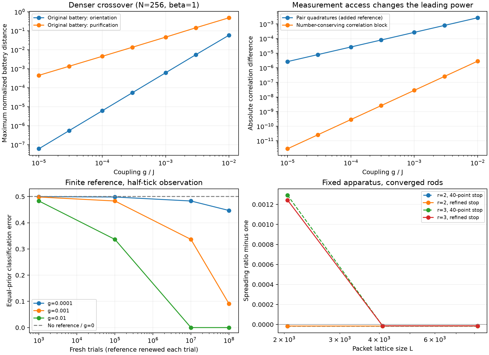

# Targeted follow-up: measurement access, crossover, and convergence

**Date:** 2026-09-22. **Design:** [follow-up study plan](followup-study-plan.md).
**Artifacts:** [manifest](../results/followup-20260922/manifest.json),
[crossover](../results/followup-20260922/crossover.json),
[pair access](../results/followup-20260922/pair-access.json),
[finite trials](../results/followup-20260922/finite-trials.json),
[spreading](../results/followup-20260922/spreading.json).

The original battery still has a nearly quadratic orientation response. Adding a
declared local pair reference exposes a linear orientation response. This changes
the permitted measurement procedure; it does not overturn the decoupled null or
the original battery's result. The added seed/window checks also show that a single
power law over the entire tested coupling interval is not robust for every
purification or battery-item comparison.

The original result JSON files and embedded web datasets are unchanged. This study
was designed after inspecting them and after an exploratory pair-correlation probe;
it is not a blinded or independently preregistered confirmation.



[Vector figure for export](../results/followup-20260922/followup-summary.svg).

## Measurement access changes the leading power

The existing battery uses normal correlations, clock traces, and spectral/entropy
readouts. It does not directly measure the phase of an anomalous R-local pair
correlation `F_ij = <c_i c_j>`. The follow-up fixes the pair at offsets `{0,-13}` rods
(nearest lattice sites `{0,-12}`), retains both quadratures, and tests three durations
`{0.25,0.5,1}` ticks. The tick is measured with the prepared, decoupled cavity and
then fixed across the compared variants.

Across N in {64,128,256}, beta in {1,4}, and all three durations, the seven-point pair-response
fits have exponents **0.999724–1.000018**. All 18 satisfy the declared fit-window
stability criterion. At N=128, beta=1, half a tick, the pair exponent is **0.999935**;
the selected normal-correlation block gives **1.999718** using its five points above
the numerical resolution floor. Some beta=4 normal-channel fits have too few
resolved points, explicitly recorded as insufficient rather than assigned an exponent.

The pair null is zero at the sampled g=0 points. Signed-g checks give an odd pair
response and an even normal response, with maximum residual **7.8e-16**. At g=1e-3,
the pair amplitudes at N=128 and 256 agree to relative **2.8e-6 or better** across the
tested temperatures and durations. N=64 is retained as a finite-size stress case.

The mechanism is visible directly in the covariance evolution. Initially, the mirror
TFD has `G_LR=0` and `F_LR!=0`. The propagator block `U_RL` is odd in g and `U_RR`
is even. Consequently,

```
G_RR(t) = U_RR G_RR(0) U_RR† + U_RL G_LL(0) U_RL†
F_RR(t) = U_RL F_LR(0) U_RRᵀ + U_RR F_RL(0) U_RLᵀ
```

Normal correlations have no linear correction, while pair correlations can have one.
This argument does not assert that every pair, duration, or nonlinear statistic has
a nonzero coefficient. The displayed exponents are measurements in the stated grid.

## A finite local reference and recorded outcomes

Each trial adds a reference with levels `|0>` and `|2>`, carrying a known phase
relative to the TFD preparation. For `b=|0><2|`, its coherence is
`<b†>=v exp(-i phi)/2`, with visibility `v=0,0.5,1`. The joint observable

```
Y = c_i c_j b† + (c_i c_j)† b
E_± = (I ± Y)/2
p(+) = [1 + v Re(exp(-i phi) F_ij)]/2
```

conserves total particle number and defines a valid binary POVM. A small independent
Fock-space calculation verifies its positivity, number conservation, and outcome
probabilities. The finite-trial test fixes `phi=pi/2`; each recorded bit can additionally
flip with probability 0 or 0.05. Every trial uses a fresh sample and reference.

For equal-prior orientation hypotheses with calibrated probabilities, the count of
positive outcomes is sufficient for the likelihood test. Exact binomial errors were
cross-checked against 4096 simulated count records per hypothesis. At N=128, beta=1,
half a tick, full reference visibility and no readout flips:

| g | 1,000 trials | 100,000 trials | 10 million trials | 100 million trials |
|---|---:|---:|---:|---:|
| 0 | 50% | 50% | 50% | 50% |
| 1e-4 | 49.98% | 49.83% | 48.32% | 44.69% |
| 1e-3 | 49.83% | 48.32% | 33.65% | 9.10% |
| 1e-2 | 48.32% | 33.66% | 0.00124% | approximately 7.1e-39% |

These are classification-error probabilities, not significance levels. A simulated
batch can contain zero mistakes when the exact error remains nonzero; both are stored.
At g=1e-3 and 100 million trials, reducing visibility to 0.5 raises error to **25.23%**;
adding 5% readout flips raises it further to **27.41%**. Without reference coherence,
this detector is exactly at chance, as it is at g=0.

This is an ideal apparatus benchmark, not a claim that the original observer can
manufacture the reference from its thermal reduced state. Joint readout access to
the two R modes, the shared preparation phase, independent resetting, and known
calibration probabilities are extra assumptions. Their preparation, transport, and
calibration costs are not included in the trial count. Nor is this an optimization
over every possible measurement. Numerical visibility alone is insufficient to
establish affordable physical detection.

## Denser crossover: robust orientation, qualified purification

The follow-up evaluates every original battery item on g=0 and seven positive
couplings from 1e-5 to 1e-2. The stored original item distances reproduce to within
**5.2e-14**. The largest extended zero-coupling battery distance is **2.4e-15**,
well below the original 1e-9 tolerance.

The following slopes describe the maximum battery distance. The low-four window is
1e-5 to 3e-4; the full window is 1e-5 to 1e-2. “Stable” means the spread across the
five declared fit windows is <=0.1, not a statistical confidence bound.

| N | beta | scramble seed | Orientation, full | Purification, full | Purification, low four | Purification stability |
|---|---|---|---:|---:|---:|---|
| 256 | 1 | 20260720 | 1.9947 | 1.0111 | 1.0021 | Stable |
| 128 | 1 | 20260720 | 1.9937 | 0.9979 | 0.9998 | Stable |
| 128 | 1 | 20260721 | 1.9937 | 0.9004 | 0.9900 | Window sensitive |
| 128 | 1 | 20260722 | 1.9937 | 0.8908 | 0.9938 | Window sensitive |
| 128 | 4 | 20260720 | 1.9925 | 0.9739 | 0.9985 | Stable |

The orientation maximum is stable in all tested combinations. The two additional
purification seeds approach linear behavior in the weaker-coupling window but fail
the full-window stability criterion. The repeated orientation values across seeds
use the same mirror-state comparison and are not independent replications.

Individual items are less uniform than their maximum. For example, the N=256,
beta=1 purification KMS item has full-window slope 1.56 and is strongly window
sensitive. The clock-ratio and KMS items can also be window sensitive on the
orientation axis. The result does not justify assigning one fitted exponent to every
item merely because the maximum follows it.

Clock calibration duration matters too. At N=128, beta=1, g=0.01, using nominal
100/200/300-unit phase-fit horizons gives orientation distances
**0.0591 / 0.0580 / 0.0578**, but purification distances
**0.9117 / 0.4214 / 0.4857**. All use the original sampling interval; exact final
sample times are stored. At g=0.001 the purification variation is smaller
(`0.05094 / 0.04919 / 0.04912`). The strong dependence at larger coupling is retained
as a limitation of this clock-defined protocol, not removed by choosing a favorable
horizon. KMS-derived numbers away from equilibrium are protocol statistics, not
automatically thermodynamic temperatures.

## Spreading and rod convergence

Exact separability makes the larger-lattice packet checks inexpensive. The 1D-factor
implementation agrees with the original 2D FFT engine, and reproduces the archived
40-point spreading ratios to within **2.8e-12**. The refined procedure locates the
first sqrt(2) growth of either measured initial width rather than stopping on a
coarse sample grid. Rods are independently checked at L=1024/2048/4096; packets at
L=2048/4096/8192. The final values use the L=4096 rods and refined stopping times.

| r | Original xi | Original R | Original heuristic sigma | Refined R, packet L=8192 | R change from L=4096 | Final quarter-lattice tail |
|---|---:|---:|---:|---:|---:|---:|
| 2 | 39.30 | 0.9999821 | 0.1588 | 0.99998409 | 8.1e-15 | 5.2e-24 |
| 3 | 55.06 | 1.0012690 | 1.0239 | 0.99998677 | 1.3e-11 | 2.7e-11 |

Both pass the declared packet-convergence criterion. The convergence differences
are numerical diagnostics, not detector error bars or rigorous bounds. The original
tail diagnostic counts mass beyond L/4, not actual wraparound probability, so its
large value should not itself be read as a measured wraparound error. These checks
resolve that ambiguity for the two selected packets and strengthen the scoped
spreading-cancellation evidence; they do not establish exact equality at finite xi.

Fits of the **existing** wavepacket data give full-window exponents -2.046, -1.947,
and -1.957 at r=1.5,2,3. Only r=1.5 passes the declared window-stability criterion.
The r=1.25 selection has just three points and is marked insufficient for this
multi-window analysis. The 1/xi² law remains a plausible leading correction, not a
precisely established exponent from the available data.

## Verification, scope, and stopping point

Both existing numerical suites, the original orientation artifact check, and seven
new measurement/failure-path tests passed before the run. The follow-up artifact
validator passes coverage, source/input/output hashes, slope recomputation,
zero-coupling controls, signed-g checks, archived-value reproduction, and the
binomial sampling comparison. The simulation stages took **59.4 seconds** on the
recorded environment, excluding preflight; this is not a runtime guarantee.

The manifest identifies base revision `c920e3c167ed308d9dfc40c44472bfd309821e65`
plus the actual modified-source hashes, Python 3.14.6, dependency versions, thread
settings, gate logs, and unchanged original input hashes. The plan and all numerical
source files were hashed before execution and verified again at completion.

The code now makes ruler calibration failure abort before the sweep, enforces its
preflight suite, and attaches provenance to future runs of both original drivers.
The ruler report and public lab now describe infrared isotropy without claiming
Lorentz invariance. The quadratic band-bottom dispersion does not establish
relativistic boost covariance or an invariant light speed.

No further sweep was added to repair unfavorable seed/window outcomes. An interacting
study remains deferred. If extending the research, the next distinct question is
whether a reference with explicit preparation, lifetime, and readout costs can retain
the pair-access advantage; the current result already shows that the leading power
depends on the declared access class. A precision RG-exponent claim would separately
require more converged wavepacket points and a fixed asymptotic fitting domain.
